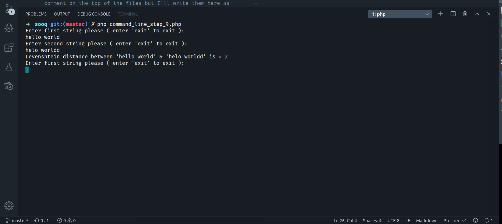
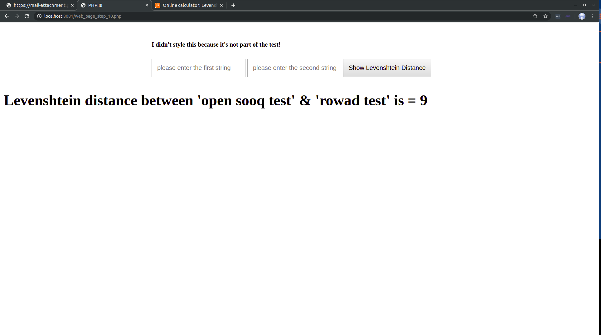

# OpenSooq Assignment - Software Engineer - Mohammed Al-rowad

This `read me` containes some information about my solution.

## Information

- I'm using `PHP 7.2.24`

- Steps from `1` to `7` are in [`Hamming.php`, `Levenshtein.php`] files.

- Step `8` is in `step_8.php` file.

- Step `9` is in `command_line_step_9.php` file.

- Step `10` is in `web_page_step_10.php` file.

Information on how to run step 9 - 10 are written as comment on the top of the files but I'll write them here as well to make it more clear.

## How to run

### Open the Terminal/cmd and 'cd' into the directory that holds the files and run the following:

```bash
> php [FILE_NAME.php]
```

## Running Step 9:

```bash
$ git clone https://github.com/MohammedAl-Rowad/OpenSooq-test.git
$ cd OpenSooq-test
$ php command_line_step_9.php
```

<details>
  <summary>Running Step 9 result !</summary>

  
</details>

## Running Step 10:

```bash
$ git clone https://github.com/MohammedAl-Rowad/OpenSooq-test.git
$ cd OpenSooq-test
$ php -S localhost:8081
# open your broswer to this link http://localhost:8081/web_page_step_10.php
```

<details>
  <summary>Running Step 10 result !</summary>

  
</details>
